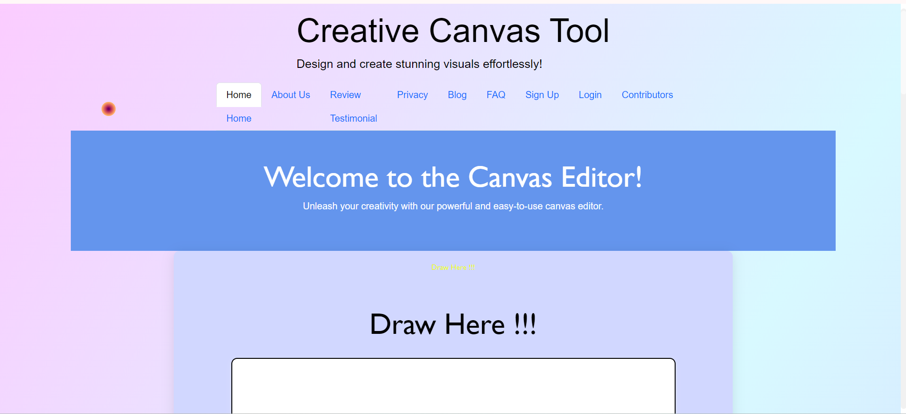
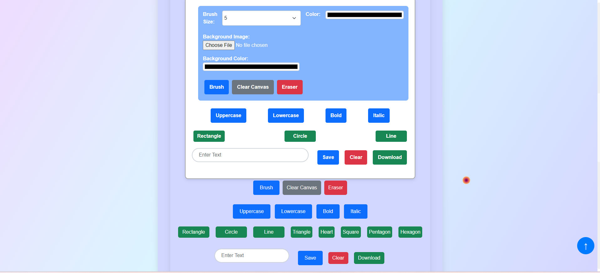

<div align="center">

# 🎨 Canvas Editor 🖌️


</div>

<div align = "center">

[](https://opensource.org/licenses/MIT)

<table align="center">
    <thead align="center">
        <tr border: 1px;>
            <td><b>🌟 Stars</b></td>
            <td><b>🍴 Forks</b></td>
            <td><b>🐛 Issues</b></td>
            <td><b>🔔 Open PRs</b></td>
            <td><b>🔕 Close PRs</b></td>
            <td><b>🛠️ Languages</b></td>
            <td><b>👥 Contributors</b></td>
        </tr>
     </thead>
    <tbody>
         <tr>
            <td></td>
            <td></td>
            <td></td>
            <td></td>
           <td></td>
           <td></td>
         <td></td>
        </tr>
    </tbody>
</table>
</div>
<br>
---

## 🚀Featured In

<table>

   <tr>
      <th>Event Logo</th>
      <th>Event Name</th>
      <th>Event Description</th>
   </tr>
   <tr>
      <td></td>
      <td>GirlScript Summer of Code 2024</td>
      <td>GirlScript Summer of Code is a three-month-long Open Source Program conducted every summer by GirlScript Foundation. It is an initiative to bring more beginners to Open-Source Software Development.</td>
   </tr>
    <tr>
      <td></td>
      <td>Hacktoberfest 2024</td>
      <td>Hacktoberfest is a month-long celebration of open source software run by DigitalOcean, GitHub, and Twilio. It encourages contributions to open source projects and promotes a global community of developers.</td>
   </tr>

</table>
<br>
---

## Table of Contents

1. [Welcome to Canvas Editor](#-canvas-editor-)
2. [Overview](#overview)
3. [New Features](#new-features-)
4. [How to Use](#how-to-use)
5. [Technology Used](#technology-used)
6. [Getting Started](#getting-started)
7. [Project Admin](#project-admin)
8. [Contribution](#contribution)
9. [Contributors](#contributors)
10. [Website Preview](#website-preview)
11. [Stargazers](#-stargazers)
12. [Forkers](#-forkers)
13. [Code of Conduct](#code-of-conduct)

---
<h2>Hi there, Enjoy the World of Open source contribution  </h2>

<strong>Hello Coders!!👨‍💻<br> I am Aanurag Vishwakarma, an aspiring Web developer🤖. Here is the project on front-end Web Development.</strong>

<!--Line-->


## <h2>Overview📌</h2>
<ul>
  <li>🎨 This repository contains my project on a Canvas Editor using HTML, CSS, Bootstrap, and JavaScript.</li>
  <li>🖼️ It includes a webpage with a canvas element that allows you to style text content as needed (made for fun purposes 🎉).</li>
  <li>🚀 We welcome all contributions to make this a fantastic resource for other users.</li>
  <li>💻 Jump in and contribute to this grand project</li>
  <li>📚 Read the guidelines and get started building! 🛠️</li>
  <li>🚀 The project now supports setting background images and colors, enhancing the customization options for your canvas!</li>
  <li>🎉 This project is open to contributions from the community. Jump in and help make it a great resource!</li>
     
</ul>

## New Features ✨
<li> Background Image: Easily set an image as the background of your canvas to create more visually appealing designs</li>
<li> Background Color: You can now add a custom background color to the canvas with ease!</li>
---

## How to Use
To change the background color or image:

<li> Navigate to the canvas options on the webpage!</li>
<li> For background color: Select a color from the color picker to apply it to the canvas!</li>
<li> For background image: Upload an image file, and it will be displayed as the canvas background!</li>
---

## <h2> Technology Used</h2>

<p>
  <a href="https://www.w3schools.com/html/"> </a>
  <a href="https://www.w3schools.com/css/"> </a>
   <a href="https://www.w3schools.com/js/"> </a>
</p>
<p align="right"><a href="#top"></a></p>
---

<br>
<!--Line-->


## <h2>Getting Started💥</h2>

<!--Line-->
 

### How to make a Pull Request?

**1.** Start by forking the [**Canvas-Editor**](https://github.com/vishanurag/Canvas-Editor) repository. Click on the <a href="https://github.com/vishanurag/Canvas-Editor/fork"></a> symbol at the top right corner.

**2.** Clone your forked repository:

```bash
git clone https://github.com/<your-github-username>/Canvas-Editor
```

**3.** Navigate to the new project directory:

```bash
cd Canvas-Editor
```

**4.** Set upstream command:

```bash
git remote add upstream https://github.com/vishanurag/Canvas-Editor
```

**5.** Create a new branch:

```bash
git checkout -b YourBranchName
```

<i>or</i>

```bash
git branch YourBranchName
git switch YourBranchName
```

**6.** Sync your fork or local repository with the origin repository:

- In your forked repository click on `Fetch upstream`.
- Click `Fetch and merge`.

### Alternatively, Git CLI way to Sync forked repository with origin repository:

```bash
git fetch upstream
```

```bash
git merge upstream/main
```

### [Github Docs](https://docs.github.com/en/github/collaborating-with-pull-requests/addressing-merge-conflicts/resolving-a-merge-conflict-on-github) for Syncing

**7.** Make your changes to the source code.

**8.** Stage your changes and commit:


⚠️ **Make sure** not to run the commands `git add .` or `git add *`. Instead, stage your changes for each file/folder

```bash
git add file/folder
```

```bash
git commit -m "<your_commit_message>"
```

**9.** Push your local commits to the remote repository:

```bash
git push origin YourBranchName
```

**10.** Create a [Pull Request](https://help.github.com/en/github/collaborating-with-issues-and-pull-requests/creating-a-pull-request)!

 **Congratulations! You've made your first contribution! 🙌🏼**
<p align="right"><a href="#top"></a></p>


## Project Admin⚡
 
<table>
<tr>
<td align="center"><a href="https://github.com/vishanurag"></a></br> <h4 style="color:red;">Anurag Vishwakarma</h4>
 <a href="https://www.linkedin.com/in/anuragvishwakarma/"></img></a>
</td>
</tr>
</table>
  
## Contribution

We are immensely grateful to the following amazing individuals who have contributed their time, effort, and expertise to make this project better. Your contributions, whether through code, documentation, bug reports, or feature suggestions, have been invaluable. Thank you for helping us build and improve Canvas Editor 🌟✨

Your dedication and hard work are what drive this project forward, and we couldn't have done it without you. Each contribution, no matter how small, plays a crucial role in our journey towards creating a more efficient and user-friendly tool for developers. 🙌💻

We look forward to your continued support and collaboration. Together, we can achieve even greater heights! 🚀🌐

Kindly go through [CONTRIBUTING.md](CONTRIBUTING.md) to understand everything from setup to contributing guidelines.

Thank you once again to all our contributors! Your efforts are truly appreciated. 💖👏

## Contributors

A heartfelt thank you to the following individuals for their valuable contributions to this project. Your support and dedication are greatly appreciated:

<a href="https://github.com/vishanurag/Canvas-Editor/graphs/contributors">
  
</a>
---

## Website Preview



---

## &#8627; Stargazers

[](https://github.com/vishanurag/Canvas-Editor/stargazers)


## &#8627; Forkers

[](https://github.com/vishanurag/Canvas-Editor/network/members)

<div align="center">
    <a href="#top">
        
    </a>
</div>

## Code of Conduct
We are committed to fostering a welcoming and inclusive environment for everyone. All contributors and participants are expected to uphold the following values:

- Be respectful of different viewpoints and experiences.
- Show empathy toward others.
- Use inclusive language.

Please read and follow our [Code of Conduct](Code_of_Conduct.md) to foster an inclusive community.
If anyone violates these standards, they may be banned from the community.

# Thanks for reading!!!